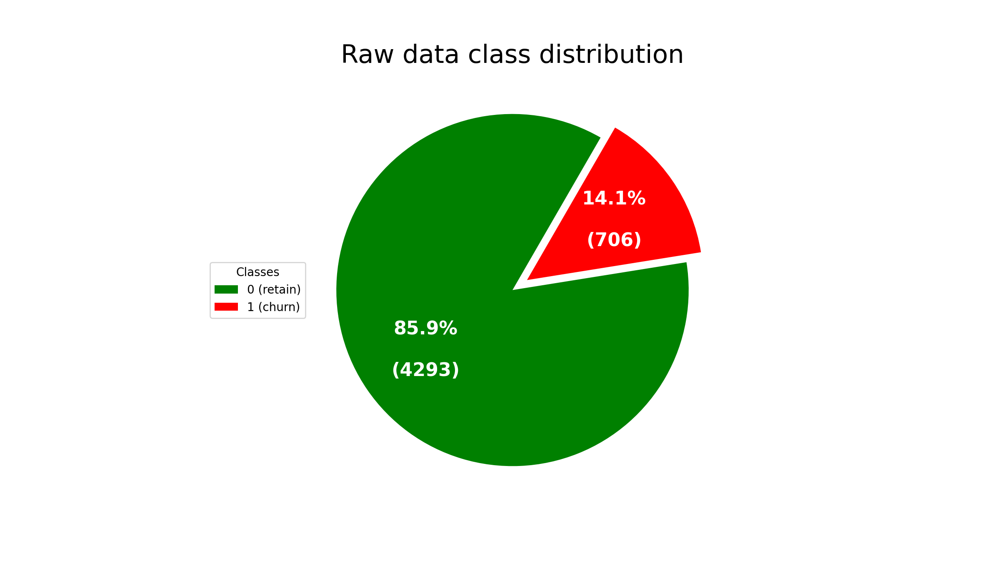

********# open points

To do that, the following tasks need to be accomplished:
1. Understand the content that is available in the dataset.
    - **spalten beschreibung?**
    - **was bedeutet was?**
        - **einheiten der werte?**
        - **redundanz in den Daten?**
    - **was ist churn?**
2. Pre-process the data and do feature selection to extract the most important features.
    - **plotting? / pairgrid**
    - **PCA? Feature Reduction...**
        - **PCA lässt sich nicht erklären... raus? oder einmal spielen? Bonus Punkte?**
3. Use a two fold cross-validation approach for evaluating all of the algorithms
mentioned below.
    - **todo...**
4. Feed Forward based classification
    - Build a feed forward neural network to classify the records into one of the two categories.
        - **einfaches Netz bauen... kein großer Aufwand**
    - Compare the performance of different activation functions and loss functions on the proposed task.
        - **model in saubere schleife bauen**
        - **mehrfach laufen lassen...**
    - Analyze the outcomes.
        - **plot history**
        - **weitere analysen?**
5. Classification method of your choice
    - Use a classifier of your choice to classify the records into one of the two categories.
    - Analyze the impact of hyperparameters on the performance of the model on validation and test sets.
    - Analyze the outcomes.
6. Use the different packages of visualization explained during the course to visualize
findings from both approaches.
7. Compare the results from both classifiers from the accuracy point of view.

# Deliverables
To carry out the assessment of the project, the group has to submit the following:

- A report using Google Doc and explaining the concept about the project solution and the expected division of the tasks regarding the components of the group. This document should not be longer than 10 pages (including cover, table of contents, etc).
- Collaborative work using Git with commit + push changes on a daily basis.
- A presentation explaining the thought process, your approaches and the reason for this choice, your findings and the real task division in your group at the end of the project. Every group has 15 minutes per presentation and there will be 5 minutes of questions.

# Telecom Customer Churn Prediction

## Project Description

### Project Source
This Project is part of the AIDA (Artifical Intelligence & Data Analysis) training programm within Deutsche Telekom AG.
It is the final project of the theoretical training part and is organized in cooperation with the DFKI (Deutsche Gesselschaft für künstliche Intelligenz). 

### Project Assignment
1. Understand the content that is available in the dataset.
2. Pre-process the data and do feature selection to extract the most important features.
3. Use a two fold cross-validation approach for evaluating all of the algorithms mentioned below.
4. Feed Forward based classification
    - Build a feed forward neural network to classify the records into one of the two categories.
    - Compare the performance of different activation functions and loss functions on the proposed task.
    - Analyze the outcomes.
5. Classification method of your choice
    - Use a classifier of your choice to classify the records into one of the two categories.
    - Analyze the impact of hyperparameters on the performance of the model on validation and test sets.
    - Analyze the outcomes.
6. Use the different packages of visualization explained during the course to visualize findings from both approaches.
7. Compare the results from both classifiers from the accuracy point of view.

### Team Members
- Jann Erik Dietert
- Tobias Habermann
- Marcus P. Sauer

## Project Documentation

### First Steps

#### Data Explotration
- What data is available?
    - churn.csv 
- How much data is it?
    - 5000 Datensätze mit 21 Features
- What are the features of the data?

Feature name | Data type | Statistics | Description
---|---|---|---
class (target) | nominal | 2 unique values (0 missing) | 1=churned / 0=not churned (assumed)
state | numeric | 51 unique values (0 missing) | unclear
account_length | numeric | 218 unique values (0 missing) | unclear
area_code | nominal | 3 unique values (0 missing) | area code of the account
phone_number | numeric | 5000 unique values (0 missing) | phone number of account
international_plan | nominal | 2 unique values (0 missing) | 1=int. plan booked / 0=not booked (assumed)
voice_mail_plan | nominal | 2 unique values (0 missing) | 1=voice mail plan booked / 0=not booked (assumed)
number_vmail_messages | numeric | 48 unique values (0 missing) | number of received voice mails
total_day_minutes | numeric | 1961 unique values (0 missing)
total_day_calls | numeric | 123 unique values (0 missing)
total_day_charge | numeric | 1961 unique values (0 missing)
total_eve_minutes | numeric | 1879 unique values (0 missing)
total_eve_calls | numeric | 126 unique values (0 missing)
total_eve_charge | numeric | 1659 unique values (0 missing)
total_night_minutes | numeric | 1853 unique values (0 missing)
total_night_calls | numeric | 131 unique values (0 missing)
total_night_charge | numeric | 1028 unique values (0 missing)
total_intl_minutes | numeric | 170 unique values (0 missing)
total_intl_calls | numeric | 21 unique values (0 missing)
total_intl_charge | numeric | 170 unique values (0 missing)
number_customer_service_calls | nominal | 10 unique values (0 missing) 
 
- Open Questions about the data:
    - What timeframe does the data reflect? (week,month, year)
    - What exactly is represented by the value 'state'? (since 'area code' suggest no mix of states)
    
#### Goal after Data Exploration

## Metrics
The given task is a ***binary classification*** with the following class labels:
* 0 : retained customer
* 1 : churned customer

Raw data shows an ***imbalanced class distribution*** with an much higher amount of retaining customers. 

Since we have an imbalanced class distribution accuracy is not the optimal metric. 
E.g. if a model would predict always 0 (no churn), we already have 
approx. 0.86 accuracy but would totally fail to predict churns.

It is necessary to observe a ***high recall value*** 
i.e. to have nearly all churners in the set of customers 
identified for potential churn

Unfortunately this could also increase the number of retaining customers seen as 
churners by mistake, this could be crucial in further handling churners if the 
number of retaining customers seen as churners is significantly higher than the real customers.
So also the ***precision must be montored*** to have an acceptable number of customers being seen as churner but are not. 